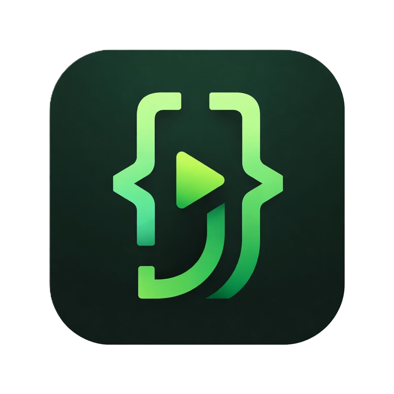

<div align="center">



# ☕ JEM — Java Execution Module

### An offline-first educational Java simulator for Android

[](https://flutter.dev)
[](https://dart.dev)
[](https://developer.android.com)
[](LICENSE)
[](https://github.com/RedsOrb/JEM/releases)

> Write, compile, and run Java programs directly on your Android phone — completely offline, no JDK required.

</div>

---

## ✨ Features

| Feature | Description |
|--------|-------------|
| ☕ **Java Interpreter** | Run Java code instantly on-device with no internet needed |
| 🎨 **Syntax Highlighting** | Full editor with highlight support for Java keywords |
| 🌙 **Dark / Light Theme** | Independent app-controlled theme with animated Sun/Moon toggle |
| 🎭 **Multiple Themes** | Forest, Ocean, Sunset, Berry, Slate & more — with custom colors |
| 🌐 **Online Community** | Share and explore programs uploaded by other users |
| 🔍 **Quick Search** | Instant search across your local program library |
| 🔔 **Smart Reminders** | Notification reminders to keep your coding streak going |
| ♻️ **Auto-Update System** | In-app updater with progress download & APK installer |
| 💾 **Local Storage** | All programs saved offline using SAF-based storage |
| 🔒 **Secure Auth** | Google Sign-In + Supabase backend for community features |

---

## 📱 Screenshots

> 🚧 Screenshots coming soon — stay tuned!

---

## 🚀 Getting Started

### Prerequisites

- [Flutter SDK](https://docs.flutter.dev/get-started/install) `>=3.10.0`
- Android Studio or VS Code with Flutter plugin
- Android device or emulator (API 21+)

### Clone & Run

```bash
# Clone the repository
git clone https://github.com/RedsOrb/JEM.git
cd JEM

# Install dependencies
flutter pub get

# Run on connected device
flutter run
```

### Build APK

```bash
flutter build apk --release
```

---

## 🏗️ Tech Stack

| Layer | Technology |
|---------|-----------|
| **UI Framework** | Flutter (Material 3) |
| **Language** | Dart |
| **State Management** | Provider |
| **Backend & Auth** | Supabase |
| **Local Storage** | SharedPreferences + SAF |
| **Networking** | http package |
| **Notifications** | flutter_local_notifications |
| **Theme** | Custom ThemeController with dynamic dark/light mode |

---

## 📦 Project Structure

```
lib/
├── app/                  # Core services (auth, theme, settings, updates)
├── models/               # Data models (User, Program, VersionInfo…)
├── screens/              # All UI screens
│   ├── home/             # Home screen with search & program list
│   ├── editor/           # Java code editor
│   ├── online/           # Community feed & program detail
│   └── settings/         # Settings & appearance
└── widgets/              # Reusable widgets (LiquidBackground, etc.)
```

---

## 🔄 Auto-Update System

JEM has a built-in update mechanism that works as follows:

1. Tap **Check for Updates** on the Update screen.
2. JEM fetches [`version.json`](https://raw.githubusercontent.com/RedsOrb/JEM/main/version.json) from this repo.
3. If a newer version is available, a **changelog popup** appears.
4. Click **Install** — the APK downloads with a live progress percentage.
5. At 100%, the Android system installer launches automatically.

The downloaded APK is cached and **auto-deleted after 12 hours**.

---

## 📋 Changelog

### v1.0.0 — Initial Release
- ✅ Offline Java interpreter for mobile
- ✅ Syntax-highlighted code editor
- ✅ Dark & Light theme with animated toggle
- ✅ Online Community to share programs
- ✅ Settings screen with customizable themes and colors
- ✅ Variable inspector during execution
- ✅ Demo programs library
- ✅ In-app auto-update system

---

## 🤝 Contributing

Contributions, issues, and feature requests are welcome!

1. Fork the repository
2. Create your feature branch: `git checkout -b feature/amazing-feature`
3. Commit your changes: `git commit -m 'Add amazing feature'`
4. Push to the branch: `git push origin feature/amazing-feature`
5. Open a Pull Request

---

## 📄 License

This project is licensed under the **MIT License** — see the [LICENSE](LICENSE) file for details.

---

<div align="center">

Made with ❤️ by [RedsOrb](https://github.com/RedsOrb)

⭐ **If you find JEM useful, please consider giving it a star!**

</div>
